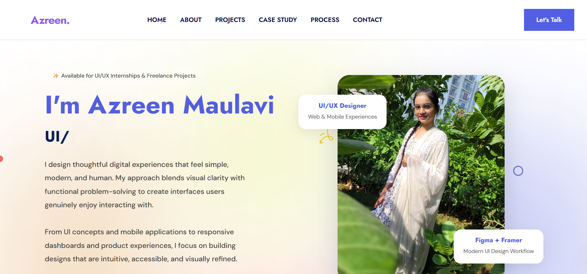

# 🎨 Azreen Maulavi — UI/UX Portfolio

A modern UI/UX portfolio showcasing thoughtful digital experiences, responsive interfaces, dashboard concepts, mobile applications, and creative web interactions.

Built with HTML, Bootstrap, CSS, and JavaScript — focused on clean aesthetics, usability, accessibility, and modern product design.

---

## ✨ Featured Projects

### 🥬 ApniSabzi Web Experience

A modern digital marketplace concept designed to support local vegetable vendors with a clean and user-friendly shopping experience.

### ✈️ Travel Dashboard UI

Responsive dashboard interface for an airline/travel management platform focused on clarity and visual hierarchy.

### 🍕 Animated Pizza Website

Interactive pizza website concept featuring engaging animations, modern layouts, and vibrant visuals.

### 🎵 Musify App Design

Music streaming app UI focused on immersive experiences, smooth navigation, and modern mobile interactions.

### 🎬 OTT Platform UI

Streaming platform interface inspired by modern entertainment applications with clean content browsing experiences.

### 🍔 LattoFatto Food Delivery App

Food ordering application UI designed for seamless browsing, ordering, and responsive mobile experiences.

---

## 🛠️ Tools & Technologies

* HTML5
* CSS3
* Bootstrap
* JavaScript
* Figma
* Framer
* Photoshop
* Notion

---

## 🌐 Live Portfolio

Add your deployed GitHub Pages link here:

https://azreenmaulavi.github.io/azreen-uiux-portfolio/

---

## 📬 Contact

* Email: [maulaviazreen@gmail.com](mailto:maulaviazreen@gmail.com)
* LinkedIn: https://www.linkedin.com/in/azreen-maulavi-b18630223/

---

## 📄 License & Credits

This portfolio is heavily customized for personal and educational use.

Originally based on the open-source Eduleb Bootstrap template licensed under MIT.
